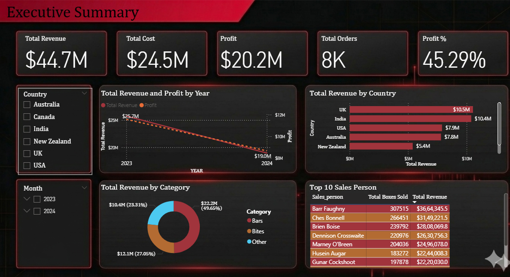

# 🍫 Chocolate Sales Power BI Dashboard

## 📌 Project Overview

This project analyzes chocolate sales data to uncover key insights related to revenue, profit, products, and regional performance.

## 📊 Key Metrics

* Total Revenue: $44.7M
* Total Profit: $20.2M
* Profit Margin: 45%
* Total Orders: 8K

## 🔍 Key Insights

* UK & India are top-performing markets (~$10M revenue each)
* Bars category contributes ~50% of total revenue
* Peanut Butter Cubes has highest profit margin (~86%)
* Weekdays generate ~79% of total sales

## 📊 Dashboard Preview

## 📈 Features

* Executive Summary
* Product Analysis
* Salesperson Performance
* Geography Analysis
* Time Analysis

## 🛠 Tools Used

* Power BI
* DAX

## 🚀 Author

Aryan Rai

