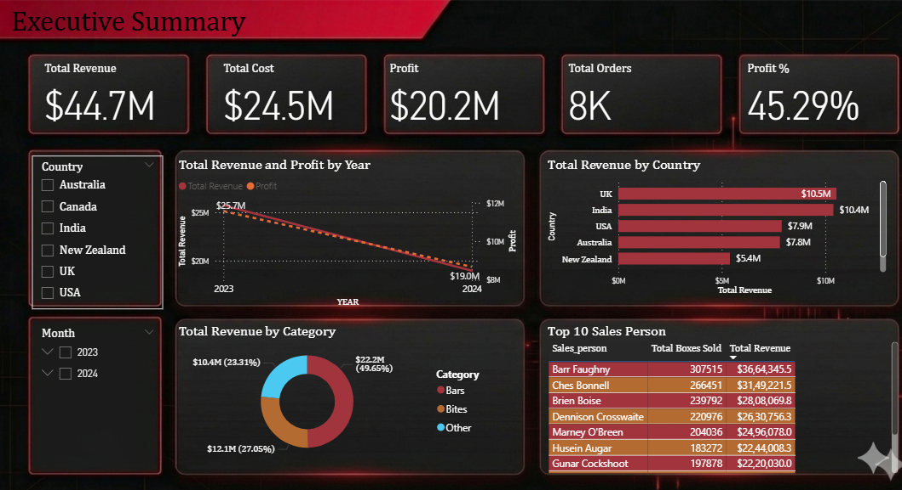
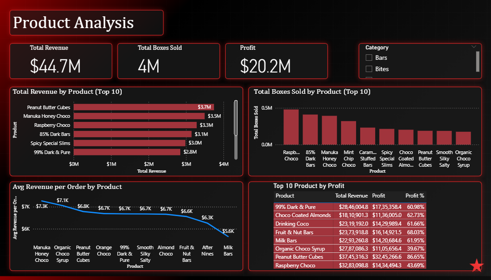
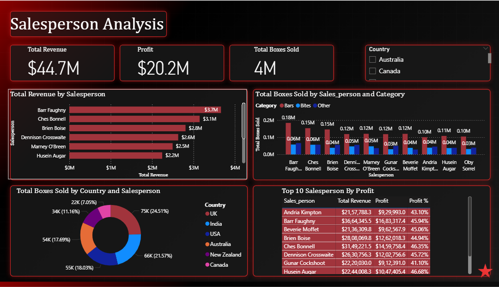
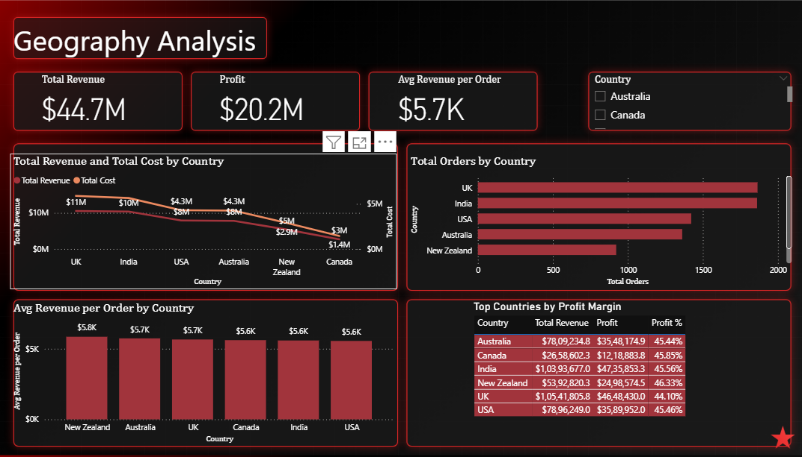
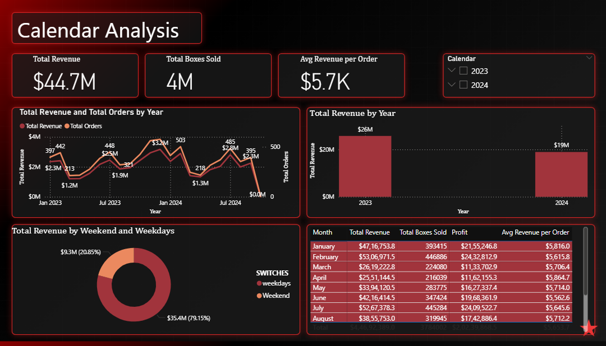

# Chocolate Sales Power BI Dashboard
### Power BI Report | Sales Performance Analysis | By Aryan Rai

---

## Overview

This Power BI dashboard analyzes chocolate sales data across countries, products, and salespersons to uncover revenue trends, profitability drivers, and performance patterns. Built to support strategic decision-making across sales, marketing, and operations.

| Metric | Value |
|--------|-------|
| Total Revenue | $44.7M |
| Total Profit | $20.2M |
| Profit Margin | 45% |
| Total Orders | 8K |

---

## Dashboard Pages

### 1. Executive Summary
Top-level KPIs with revenue, profit, and order trends.  
**Key Insight:** Business maintains a healthy 45% profit margin, with strong performance concentrated in two key markets.

### 2. Product Analysis
Revenue and margin breakdown by product category and individual products.  
**Key Insight:** Bars category contributes ~50% of total revenue. Peanut Butter Cubes leads all products with ~86% profit margin — a high-efficiency SKU worth scaling.

### 3. Salesperson Performance
Individual salesperson revenue, order count, and efficiency metrics.  
**Key Insight:** Performance varies significantly across the sales team, highlighting opportunities for targeted coaching and incentive structuring.

### 4. Geography Analysis
Country-wise revenue, profit, and market contribution.  
**Key Insight:** UK and India are top-performing markets contributing ~$10M revenue each, together accounting for nearly 45% of total sales.

### 5. Calendar Analysis
Monthly and weekday vs. weekend sales patterns.  
**Key Insight:** Weekdays drive ~79% of total sales, indicating a B2B-dominant purchasing pattern. Seasonal peaks visible in specific months.

---

## Tools & Technologies

| Tool | Usage |
|------|-------|
| Power BI Desktop | Dashboard development & visualisation |
| DAX | Calculated measures for KPIs and growth metrics |
| Power Query (M) | Data transformation and cleaning |

---

## Key DAX Measures Used

```dax
Total Revenue = SUM(Sales[Amount])
Total Profit = [Total Revenue] - [Total Cost]
Profit Margin = DIVIDE([Total Profit], [Total Revenue])
MoM Growth = DIVIDE([Total Revenue] - [Prev Month Revenue], [Prev Month Revenue])
```

---

## Data Model

The report uses a star schema with:
- **Fact Table:** Sales (transactions, revenue, cost)
- **Dimension Tables:** Product, Salesperson, Geography, Date/Calendar

---

## Dashboard Preview

### Executive Summary


### Product Analysis


### Salesperson Analysis


### Geography Analysis


### Calendar Analysis


---

## File Structure

```
chocolate-sales-powerbi-dashboard/
│
├── Chocolate Sales.pbix           # Main Power BI file
├── Chocolate Sales.pdf            # Full dashboard export
├── README.md                      # Project documentation
│
├── Executive_Summary.png          # Page 1 preview
├── Product_Analysis.png           # Page 2 preview
├── Sales_Person_Analysis.png      # Page 3 preview
├── Geography_Analysis.png         # Page 4 preview
└── Calendar_Analysis.png          # Page 5 preview
```

---

## How to Use

1. Open `Chocolate Sales.pbix` in **Power BI Desktop**.
2. Use the slicers (Country, Product Category, Salesperson) to filter the data.
3. Navigate between pages using the bottom tab bar.
4. Hover over visuals for detailed tooltips.
5. For a static view, open `Chocolate Sales.pdf`.

---

## Author

**Aryan Rai**  
BS Data Science — IIT Madras  
Data Analytics Certification — NDMIT Varanasi  
📧 aryanrai2555@gmail.com  
📞 9670262555  
🔗 [LinkedIn](https://www.linkedin.com/in/aryan-rai-590549310)

---

*Built as part of NDMIT Data Analytics Certification coursework.*
